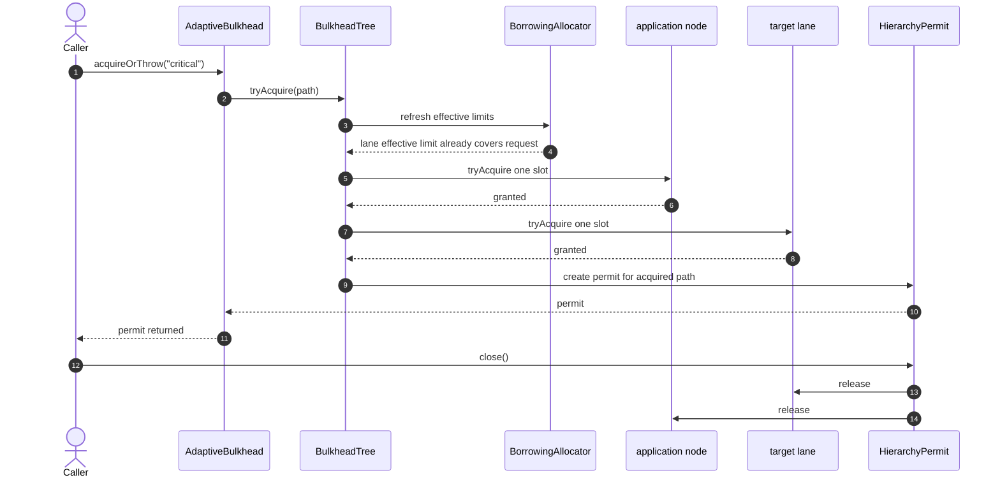
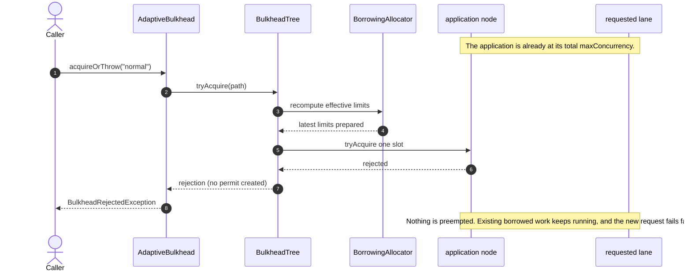
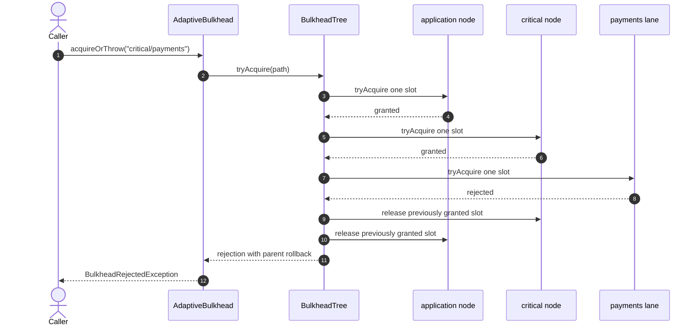

# AdaptiveBulkhead sequence diagrams

These diagrams keep the main README short and show the most important admission flows step by step.

## 1. Normal acquisition

The request fits inside the lane's own effective limit, so no borrowing is needed.



## 2. Higher-priority lane borrows from a lower-priority lane

Example setup:

- application total limit = 10
- `critical` guaranteed = 4, max = 6, maximum borrow = 2
- `normal` guaranteed = 6, minimum retained = 2

If `normal` is only using 2 slots, 2 of its idle slots may be lent to `critical`.

```mermaid
sequenceDiagram
    autonumber
    actor Caller
    participant AB as AdaptiveBulkhead
    participant Tree as BulkheadTree
    participant Alloc as BorrowingAllocator
    participant App as application node
    participant Critical as critical lane
    participant Normal as normal lane
    participant Permit as HierarchyPermit

    Note over Critical,Normal: Normal has 4 idle slots and may lend 2 of them.
    Caller->>AB: acquireOrThrow("critical")
    AB->>Tree: tryAcquire(path)
    Tree->>Alloc: recompute effective limits
    Alloc->>Normal: reserve minimum retained capacity
    Normal-->>Alloc: 2 lendable slots remain
    Alloc-->>Tree: critical effective limit becomes 6
    Tree->>App: tryAcquire one slot
    App-->>Tree: granted
    Tree->>Critical: tryAcquire one slot under revised limit
    Critical-->>Tree: granted
    Tree->>Permit: create permit
    Permit-->>AB: permit
    AB-->>Caller: permit returned
    Note over Critical,Normal: Total active work still stays within the application limit of 10.
    Caller->>Permit: close()
    Permit->>Critical: release
    Permit->>App: release
```

## 3. Fail-fast rejection with rollback

This shows why the total limit stays fixed even when a lane previously borrowed capacity: if no total slot is free now, the new request is rejected immediately.



## 4. Path rejection after a parent grant

In a hierarchy, admission walks from root to leaf. If a parent grants but a deeper lane rejects, the already-acquired parent slot is released immediately.


